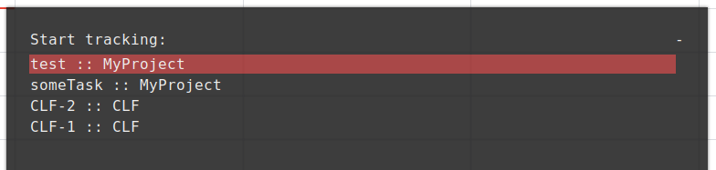

# Clockify API wrapper for making switching tasks easier
Script for easy binding of [`dmenu`](https://tools.suckless.org/dmenu/)/[`rofi`](https://github.com/davatorium/rofi) + tracker ([`clockify-cli`](https://github.com/lucassabreu/clockify-cli) only) + any status bar

## Features
* Start/stop time entries via `dmenu`/`rofi`/`fzf`, thus autocompletion and fuzzy search
* History of time entries
* Notifications via `notify-send`
* Status command for a system bar in `HH:MM` format
* Time entries synchronization/download with a server (do only once)

Time entry selection in  [`rofi`](https://github.com/davatorium/rofi):


Running time entry in [`polybar`](https://github.com/polybar/polybar):


## Dependencies
* Some selector program that takes a list of items on the input and prints what user selected or typed on the output:  [`dmenu`](https://tools.suckless.org/dmenu/), [`rofi`](https://github.com/davatorium/rofi), [`fzf`](https://github.com/junegunn/fzf)
* Backend for the real tracking. Currently only [`clockify-cli`](https://github.com/lucassabreu/clockify-cli) is supported, but extension is possible
* `m4`
* `awk`
* `sed`

## Build
Build command takes one optional argument: name of the backend which must correspond to (e.g. `mybackend` → `src/backends/mybackend.hs`)
```shell
./build [backend]
install "${PWD}/clfy" /usr/bin/clfy
```

## Usage
A time entry started with `clfy` must be stopped with `clfy`, and a time entry started somewhere else must be stopped somewhere else or some desync may occur.
To download/synchronize time entries for the last 30 days run
```
clfy sync 30
```
### Usage
```
clfy sync          -  update local time entries names and projects (call once)
clfy start <entry> -  start tracking
clfy stop          -  stop tracking
clfy start-dmenu   -  start tracking using dmenu
clfy status        -  print status for a bar
clfy help
```

## Configuration
Everything related to backend (e.g. authentication) is configured separately.
`clfy` currently has no config right now, but configuration is possible at a build time. Copy default [src/options](src/options) file to the root of the repository and it will affect the build

### Options
Most of the options are file related, here are few interesting ones:
#### `clockify_proj_delim`
is used to set delimeter between description and project for `clockify-cli` backend
#### `selector`:
* `dmenu -p`
* `rofi -dmenu -p`
* `fzf --header hi`
#### `notifier`:
* `notify-send`
* `echo` could be used with `fzf`
The backend may be chosen at build time


## Bindings
### `i3`/`i3-gaps`
```
bindsym $mod+c       exec --no-startup-id clfy start-dmenu
bindsym $mod+Shift+c exec --no-startup-id clfy stop
```
### `polybar`
```
[module/tracker]
type = custom/script
exec = clfy status
interval = 4
format-prefix = " "
```
